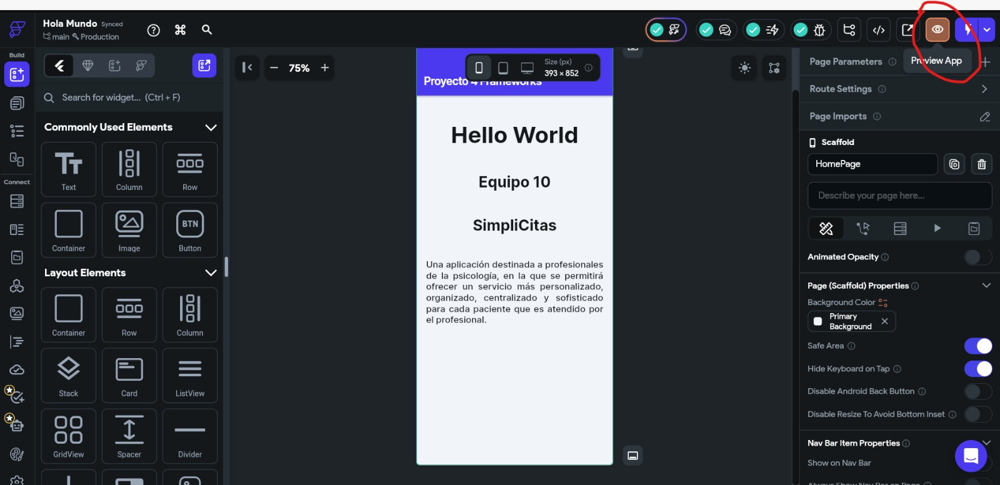
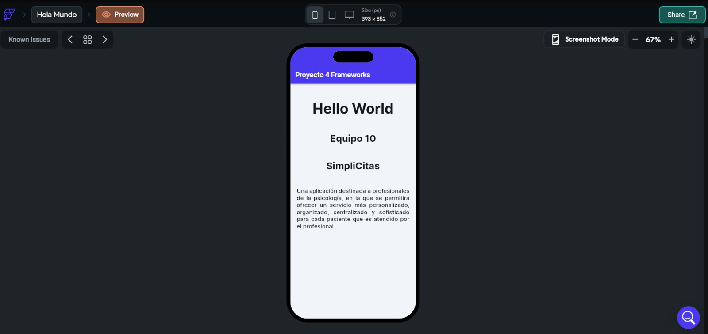

CONSIDERACIONES PARA TRABAJAR CON FLUTTER FLOW

\*\*NO ES NECESARIA NINGUNA INSTALACIÓN NI REQUISITOS PREVIOS ADEMÁS DE UNA BUENA CONEXIÓN A INTERNET. FLUTTER FLOW ES UNA PLATAFORMA QUE NOS PERMITE TRABAJAR EN LA MISMA WEB.\*\*

1\. COMANDOS DE EJECUCIÓN

\*DESDE FLUTTER FLOW CLI, EJECUTAR EL COMANDO flutter run

\*EN LA MISMA CLI, EL SIGUIENTE COMANDO SERVIRÁ PARA CREAR UN APK PARA ANDROID Y/O iOs:

	***flutter build apk \--release***

	***flutter build ios \--release***

2\. IMAGENES DEL ARCHIVO CORRIENDO DESDE LA PLATAFORMA

\*\*ARCHIVO PREVIO A LA VISUALIZACIÓN, ESTE MISMO SEÑALA EL BOTÓN QUE NOS PERMITIRÁ REALIZAR UNA PREVISUALIZACIÓN DE NUESTRO ARCHIVO\*\*

\*\*ARCHIVO CORRIENDO EN LA PREVISUALIZACIÓN\*\*   

